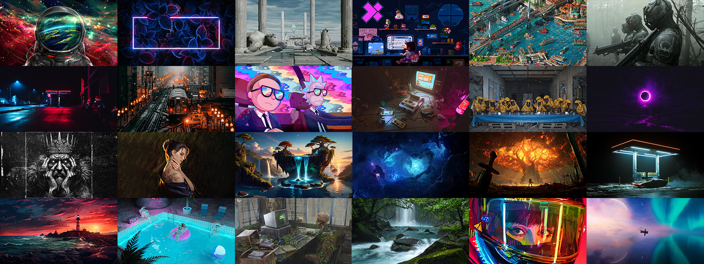

[](http://github.com/Venxe/wallpapers?tab=readme-ov-file#categories)

<p align="center">
  
  <a href="https://www.buymeacoffee.com/sayimburak" target="_blank"></a>
</p>

# Awesome Wallpaper Collection

Welcome to my awesome wallpaper collection! This repository features a carefully curated selection of stunning wallpapers, all created by talented and creative artists. It will be regularly updated with new wallpapers to keep the collection fresh and inspiring!

## 🖼️ Image Quality
All wallpapers in this collection are at least 4K resolution. To optimize file size without sacrificing quality, high-resolution PNG images have been converted to JPEG using "jpeg-li." Images that were already well-optimized in their original format remain unchanged.

## 📂 Categories
The wallpapers are organized into the following categories:

- [**Abstract**](wallpapers/Abstract/) – Creative and imaginative abstract designs.
- [**Art**](wallpapers/Art/) – A collection of various artistic works, including digital and traditional styles.
- [**Gaming**](wallpapers/Gaming/) – High-energy and visually captivating gaming-themed wallpapers.
- [**Minimalism**](wallpapers/Minimalism/) – Elegant and clean minimalist art.
- [**Nature**](wallpapers/Nature#nature-wallpapers) – Stunning landscapes, forests, oceans, and more.
- [**Space**](wallpapers/Space/) – Fascinating cosmic and astronomical visuals.
- [**Urban**](wallpapers/Urban/) – Captivating cityscapes and architectural marvels.


## ⚙️ Installation
Run the following command in the terminal to download and install the wallpapers:
### Linux:
```bash
curl -sSL https://raw.githubusercontent.com/Venxe/wallpapers/main/installers/install_linux.sh -o install_linux.sh && chmod +x install_linux.sh && ./install_linux.sh
```
### Windows:
```bash
Invoke-WebRequest -Uri "https://raw.githubusercontent.com/Venxe/wallpapers/main/installers/install_win.ps1" -OutFile "install_win.ps1"; powershell -ExecutionPolicy Bypass -File "install_win.ps1"
```
<sub>Wallpapers are installed in the following locations:</sub>  
<sub>📁 **Linux:** `~/Pictures/Wallpapers`</sub>  
<sub>📁 **Windows:** `C:\Users\%USERNAME%\Pictures\Wallpapers`</sub>

## 📜 Disclaimer
This collection is provided under the terms specified in the [LICENSE](LICENSE) file. All wallpapers are the property of their respective creators. I do not claim ownership of any works here; I have only compiled and optimized them for easier access.  

If you are the original creator and would like credit or removal, please [open an issue](../../issues).

### Credits
Special thanks to the communities at [Wallhaven](https://wallhaven.cc/) and the [r/unixporn](https://www.reddit.com/r/unixporn/) subreddit for providing these amazing wallpapers.
