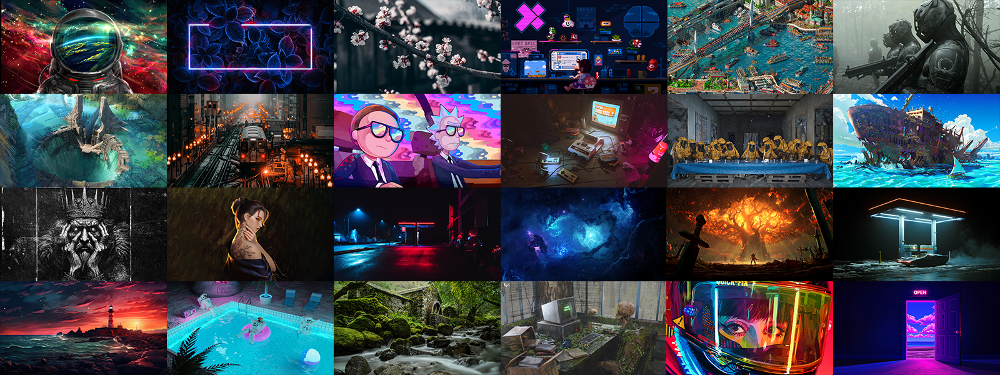

[](http://github.com/sayimburak/wallpapers?tab=readme-ov-file#categories)

<p align="center">
  
  <a href="https://www.buymeacoffee.com/sayimburak" target="_blank"></a>
</p>

# Awesome Wallpaper Collection

Welcome to my awesome wallpaper collection! This repository features a carefully curated selection of stunning wallpapers, all created by talented and creative artists. It will be regularly updated with new wallpapers to keep the collection fresh and inspiring!

## 🖼️ Image Quality
All wallpapers in this collection are provided in at least 4K resolution and have been optimized for both highest quality and minimal file size using tools like 'Jpegli' and 'OptiPNG'.

## 📂 Categories
The wallpapers are organized into the following categories:

- [**Abstract**](wallpapers/Abstract/README.md) – Bold and imaginative abstract compositions
- [**Anime**](wallpapers/Anime/README.md) – Stunning illustrations and iconic anime-inspired visuals
- [**Art**](wallpapers/Art/README.md) – A diverse collection of digital and traditional artworks
- [**Coding**](wallpapers/Coding/README.md) – Tech-inspired visuals and programming aesthetics
- [**Gaming**](wallpapers/Gaming/README.md) – Dynamic and immersive gaming-themed designs
- [**Minimalism**](wallpapers/Minimalism/README.md) – Sleek, simple, and elegant minimalist art
- [**Nature**](wallpapers/Nature/README.md) – Breathtaking landscapes, oceans, and forests
- [**Space**](wallpapers/Space/README.md) – Mesmerizing cosmic and astronomical imagery
- [**Urban**](wallpapers/Urban/README.md) – Striking cityscapes and modern architecture


## ⚙️ Installation
Run the following command in the terminal to download and install the wallpapers:
### Linux:
```bash
curl -sSL https://raw.githubusercontent.com/sayimburak/wallpapers/main/installers/install_linux.sh -o install_linux.sh && chmod +x install_linux.sh && ./install_linux.sh
```
### Windows:
```bash
Invoke-WebRequest -Uri "https://raw.githubusercontent.com/sayimburak/wallpapers/main/installers/install_win.ps1" -OutFile "install_win.ps1"; powershell -ExecutionPolicy Bypass -File "install_win.ps1"
```
<sub>Wallpapers are installed in the following locations:</sub>  
<sub>📁 **Linux:** `~/Pictures/Wallpapers`</sub>  
<sub>📁 **Windows:** `C:\Users\%USERNAME%\Pictures\Wallpapers`</sub>

## 📜 Disclaimer
This collection is provided under the terms specified in the [LICENSE](LICENSE) file. All wallpapers are the property of their respective creators. I do not claim ownership of any works here; I have only compiled and optimized them for easier access.  

If you are the original creator and would like credit or removal, please [open an issue](../../issues).

### Credits
Special thanks to the communities at [Wallhaven](https://wallhaven.cc/) and the [r/unixporn](https://www.reddit.com/r/unixporn/) subreddit for providing these amazing wallpapers.
