# Space – Mesmerizing cosmic and astronomical imagery

tags: `planet`
[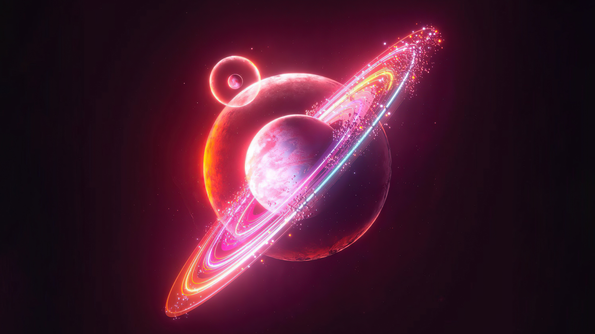](https://raw.githubusercontent.com/sayimburak/wallpapers/refs/heads/main/wallpapers/Space/space-planet-01.jpg)

tags: `stars` `blue`
[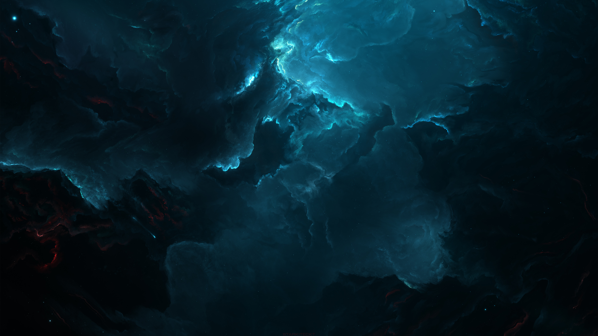](https://raw.githubusercontent.com/sayimburak/wallpapers/refs/heads/main/wallpapers/Space/space-stars-blue-01.jpg)

tags: `stars` `blue`
[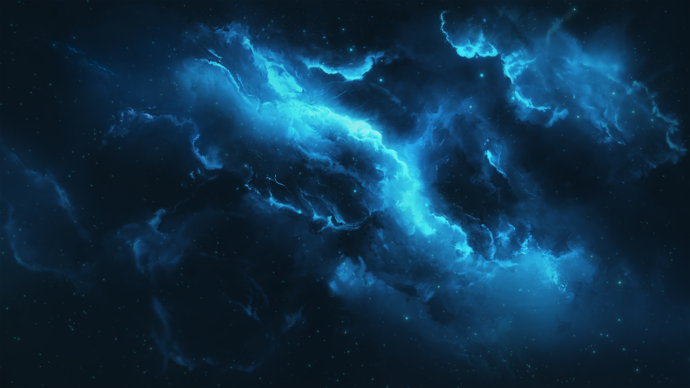](https://raw.githubusercontent.com/sayimburak/wallpapers/refs/heads/main/wallpapers/Space/space-stars-blue-02.jpg)

tags: `stars` `blue`
[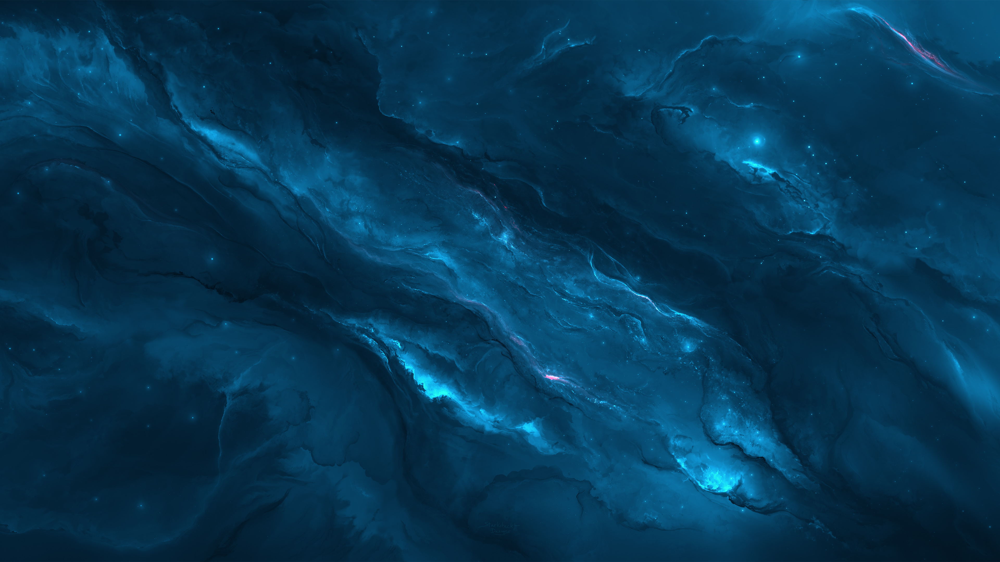](https://raw.githubusercontent.com/sayimburak/wallpapers/refs/heads/main/wallpapers/Space/space-stars-blue-03.jpg)

tags: `stars` `blue`
[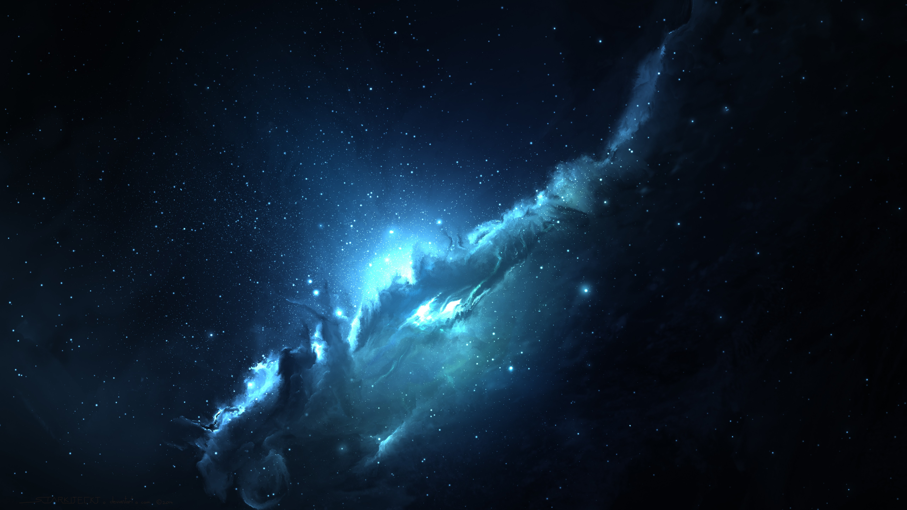](https://raw.githubusercontent.com/sayimburak/wallpapers/refs/heads/main/wallpapers/Space/space-stars-blue-04.jpg)

tags: `stars` `blue`
[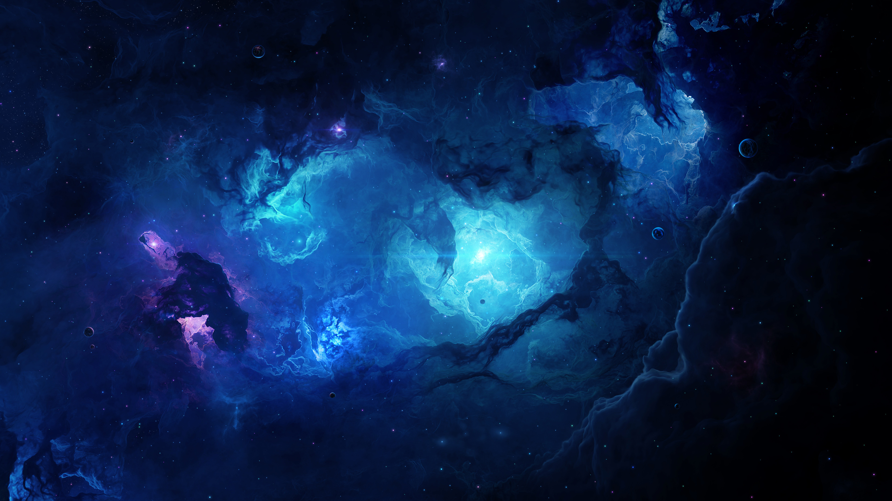](https://raw.githubusercontent.com/sayimburak/wallpapers/refs/heads/main/wallpapers/Space/space-stars-blue-05.jpg)

tags: `stars` `nebula`
[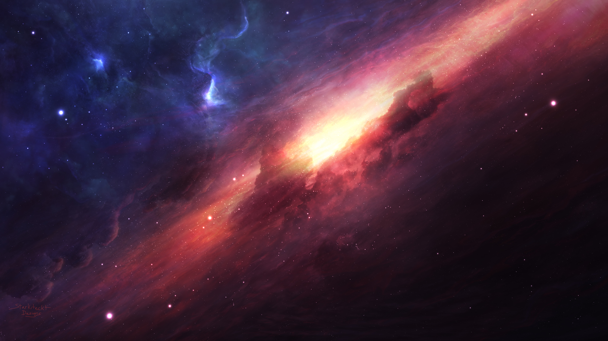](https://raw.githubusercontent.com/sayimburak/wallpapers/refs/heads/main/wallpapers/Space/space-stars-nebula-01.jpg)

tags: `stars` `nebula`
[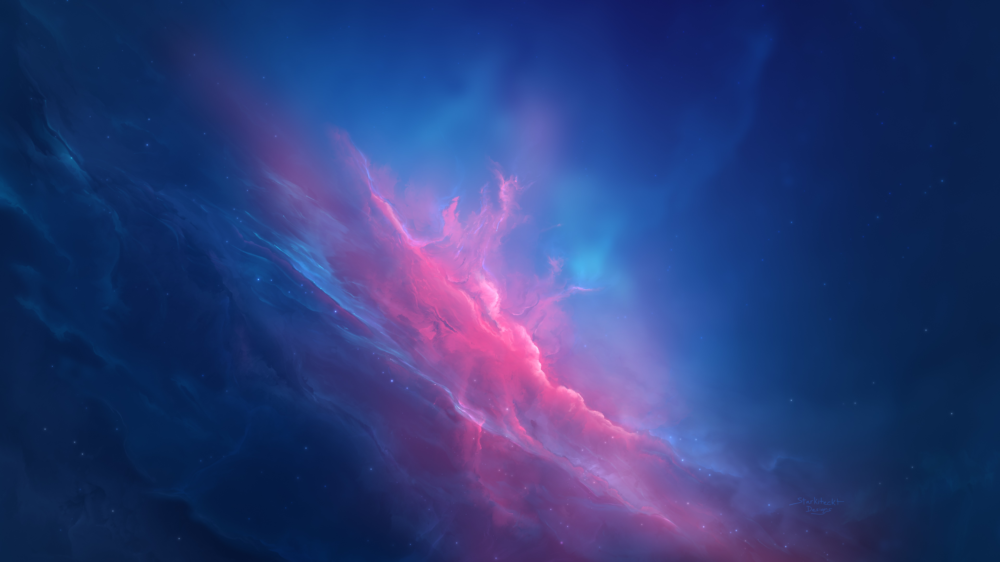](https://raw.githubusercontent.com/sayimburak/wallpapers/refs/heads/main/wallpapers/Space/space-stars-nebula-02.jpg)

tags: `stars` `nebula`
[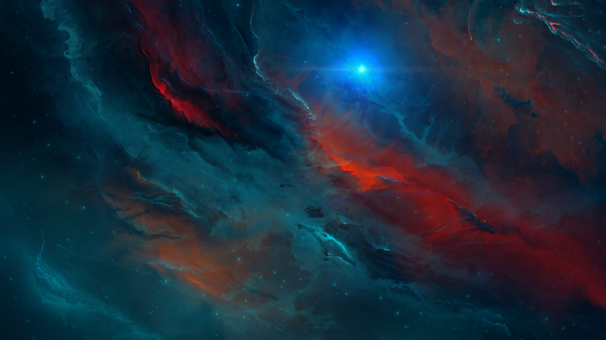](https://raw.githubusercontent.com/sayimburak/wallpapers/refs/heads/main/wallpapers/Space/space-stars-nebula-03.jpg)

tags: `stars` `purple`
[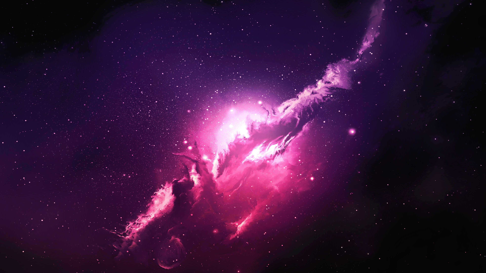](https://raw.githubusercontent.com/sayimburak/wallpapers/refs/heads/main/wallpapers/Space/space-stars-purple-01.jpg)

tags: `stars` `red`
[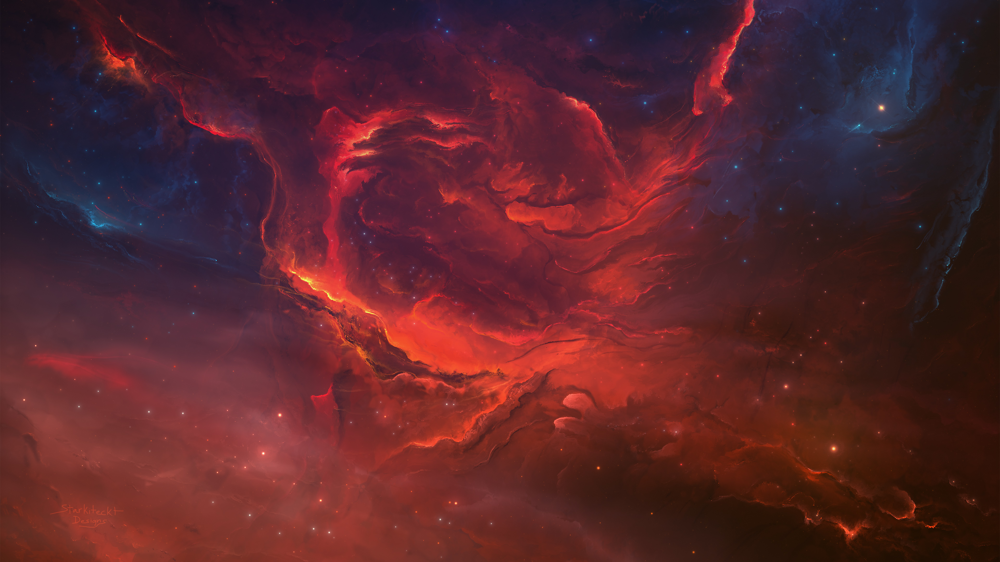](https://raw.githubusercontent.com/sayimburak/wallpapers/refs/heads/main/wallpapers/Space/space-stars-red-01.jpg)
